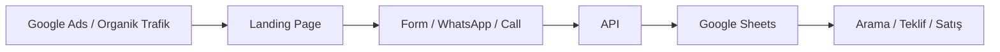

# GuvenlikServisi Lead Engine

## Amaç

İlk 6 ayın amacı "platform kurmak" değil, reklamla gelen sıcak talepleri verimli şekilde toplamak, ölçmek ve satışa çevirmektir.

Bu proje ilk aşamada bir **lead engine** olarak çalışmalıdır.

Temel akış:

---

## Şu Anki Sistem

Bugünkü mimari çekirdek olarak çalışıyor:
- Form verisi `/api/lead` üzerinden alınıyor.
- E-posta ile bildirim gidiyor.
- Aynı anda Google Apps Script webhook'una post ediliyor.
- Lead'ler Google Sheet'e düşüyor.

Bu, erken aşama için yeterli çünkü şu anda asıl darboğaz veri tabanı değil, **trafik ve satış operasyonu**.

---

## Neden Şimdilik Google Sheets Yeterli

Google Sheet şu aşamada yeterli çünkü:
- hızlı kurulur
- ücretsizdir
- teknik yükü azdır
- satış operasyonu için görülebilir yapı sunar
- ilk 100–500 lead aralığında iş görür

Ama şu sorunları vardır:
- duplicate lead yönetimi zayıf
- filtreleme / raporlama kısıtlı
- otomasyon ölçeklenince dağılır
- admin panel yerine manuel takip gerekir

Bu yüzden doğru karar şudur:

**Önce Google Sheet'i düzenle, sonra ihtiyaç doğunca Supabase'e geç.**

---

## Lead Veri Şeması

Önerilen minimum kolonlar:

| Kolon | Açıklama |
|---|---|
| timestamp | lead geliş zamanı |
| name | müşteri adı |
| phone | normalize edilmiş telefon |
| district | ilçe |
| place_type | mekan tipi |
| camera_count | tahmini kamera sayısı |
| message | serbest metin |
| page | geldiği URL |
| utm_source | trafik kaynağı |
| utm_medium | medium |
| utm_campaign | kampanya |
| utm_term | anahtar kelime / terim |
| gclid | Google click ID |
| lead_status | Yeni / Arandı / Teklif / Kazanıldı / Kaybedildi |
| assigned_to | sorumlu kişi |
| offer_amount | verilen teklif |
| lost_reason | kayıp sebebi |
| notes | satış notları |

---

## Kritik KPI'lar

Bu sistemde bakılacak asıl metrikler:

### Trafik KPI
- tıklama maliyeti (CPC)
- landing page CTR
- bounce / düşük etkileşim sinyali

### Lead KPI
- form dönüşüm oranı
- WhatsApp tıklama oranı
- call click oranı
- toplam lead / şehir
- toplam lead / hizmet

### Satış KPI
- ilk arama süresi
- aramaya cevap oranı
- teklif verilen lead oranı
- kapanış oranı
- iş başı ciro
- şehir bazlı kârlılık

---

## Operasyon Kuralı

Lead motoru kod kadar operasyonla kazanır.

Kural seti:
1. Lead geldikten sonra en geç 5 dakika içinde ilk arama.
2. Ulaşılamayan lead en az 3 kez farklı saatte aranır.
3. Teklif verilen her lead sheet üzerinde işaretlenir.
4. Kaybedilen lead'lerde kayıp nedeni yazılır.
5. Aynı gün kapanmayan sıcak lead'lere follow-up yapılır.

---

## Sonraki Mimari Geçiş

Aşağıdaki eşiklerden biri olursa Supabase'e geçilir:
- aylık 300+ lead
- ekipte birden fazla satışçı
- otomatik assignment ihtiyacı
- dashboard ve filtre ihtiyacı
- offline conversion / CRM entegrasyonu ihtiyacı

O güne kadar ana hedef: **lead akışını stabilize etmek.**
